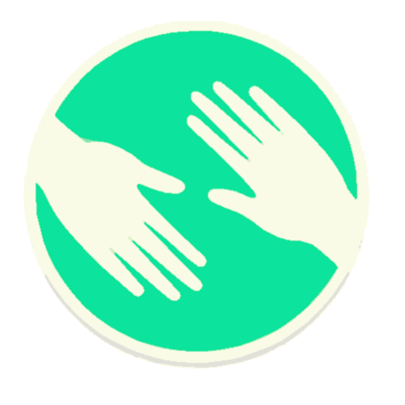

# 🧪 L'Arche des soins (protojam)
<div style="display: flex; justify-content: center; width: 100%;">
  
</div>

## 🎯 Description
L'Arche des Soins est un site développé dans le cadre du Protojam. Il a été réalisé après le projet 2, en équipe de cinq personnes, sur une durée d’un jour et demi.  
La thématique imposée était de créer un site autour de la bienveillance dans un monde post-apocalyptique. Nous avons donc conçu une plateforme répertoriant des médicaments que l'on peut fabriquer soi-même, avec une liste détaillée des ingrédients à mélanger pour chaque remède. 

## 👁️ Déployer
[voir le site](https://protojam.clement-fiquet.fr)

## ⚙️ Installation en Local
### 🛠️ Outils à avoir
- Git
- Npm
- Terminal de commande

#### 🛜 Installation
- Cloner le dépôt GitHub

À la racine du projet depuis un terminal de commande
 - Installer les dépendances du projet :
    ```sh
    npm install
    ```
  - Lancer le site :
    ```sh
    npm run dev
    ```
  - Allez sur votre localhost:3000 depuis un navigateur

## 🤖 Technologies utilisées
### 🌐 Frontend  


 


### 🖥️ Backend  


### 🛠️ Outils


### 🚀 Hébergement  


## 👨‍💻 Développeur fondateur
- **[@Clément](https://github.com/clement4444)**    
- **[@Philippe](https://github.com/Philippevde)**   
- **[@Victor](https://github.com/victorSanLopez)**   
- **[@Badreddine](https://github.com/Badre-s)**   
- **[@Cristine](https://github.com/ChristineV67)**   